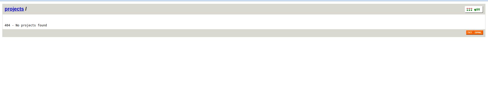
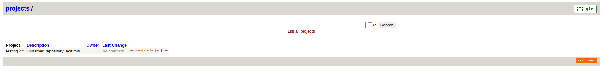

# Simple Git Server

## Introductions
This repository contains the Dockerfile, the docker-compose and other script needed to run and serve a git 
service base on:
* [gitolite](https://gitolite.com/gitolite/index.html)
* [gitweb](https://git-scm.com/docs/gitweb)

The git content will be avaialble via http and ssh ( the docker container contains a nginx and sshd server).

The git server can be managed throught the gitolite-admin repository.

## Run The Container

```
$ git clone https://github.com/stethewwolf/docker_simple-git-srv.git simple-git-srv
$ cd simple-git-srv
$ docker-compose up -d
```

In this way the container will open the ports 80 and 22, by defaults no repository should visible.

## Confiration and Customizations

Most of the configuration can be performed using the `docker-compose.yml` file present in this repository

### Git data

Inside the container all the git data is contained into the folder
`/var/lib/git`

I should be mounted into a volume ( as in the  `docker-compose.yml` ) or
mounted into a folder.

The defaul content is :

```
/var/lib/git/
|-- .bashrc
|-- .gitolite
|   |-- conf
|   |-- hooks
|   |-- keydir
|   `-- logs
|-- .gitolite.rc  # if present gitolite init is skipped
|-- .ssh
|   |-- authorized_keys
|   |-- gitolite   
|   `-- gitolite.pub  # this is the admin public key, if missing a new ssh
|						keys pai is generated 
|-- bin
|-- log
|   |-- nginx-access.log
|   `-- nginx-error.log
|-- projects.list
|-- repositories			# this folder contains bare repositories
|   |-- gitolite-admin.git
|   `-- testing.git
`-- tmp
```

The system expect the admin public key with this skema:
```
	$GIT_HOME_DIR/.ssh/$GIT_ADMIN.pub
``` 

## Next Steps

### Test ssh connection

Exmaple for user ssh config file
```
Host simple-git-srv
    HostName localhost
    Port 2222
    User git
    IdentityFile ~/tmp/gitolite
```

You can test the connection:
```
ssh  simple-git-srv
hello gitolite, this is git@1bf2152f7330 running gitolite3 3.6.12-1 (Debian) on git 2.39.2

 R W	gitolite-admin
 R W	testing
Connection to localhost closed.
```

you can clone  
```
git clone simple-git-srv:gitlite-admin 
```

### Test web connection

By default the  project list is empty:



edit the file  `gitolite-admin/conf/gitolite.conf` like this:
```
@secret = gitolite-admin
 
repo  @secret
  - = gitweb daemon
  option deny-rules = 1
 
repo  @all
  R = gitweb daemon
 
repo  gitolite-admin
  RW+ = myuser
 
@test_users = myuser otheruser
repo  testing
  config gitweb.owner = "Antonio Ospite"
  config gitweb.description = "Test repository"
  RW+ = @test_users

```

now you should be able to see at least one repo:




## References
* [git](https://git-scm.com/)
* [gitolite](https://gitolite.com/gitolite/index.html)
* [gitweb](https://git-scm.com/docs/gitweb)

